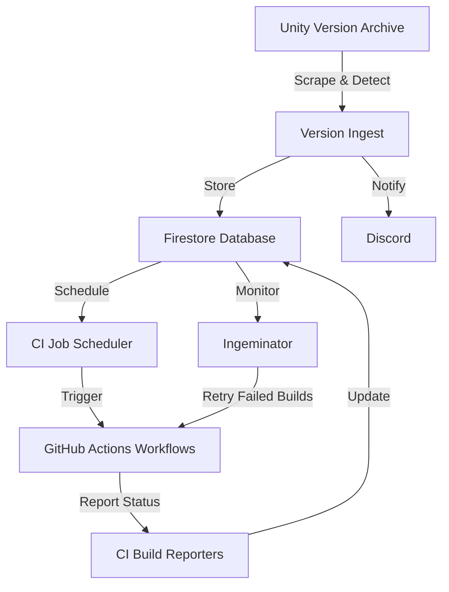

# GameCI Versioning Backend

The GameCI Versioning Backend automates the tracking, scheduling, and building of Unity versions and Docker images for the GameCI ecosystem. It connects with GitHub Actions for CI/CD workflows and Discord for notifications.

## System Overview



## Unity Version Ingest

The backend regularly scrapes Unity version information:

1. Uses the [`unity-changeset` package](https://github.com/mob-sakai/unity-changeset) from [mob-sakai](https://github.com/mob-sakai) to detect new Unity versions
2. Filters versions (only stable versions 2021+)
3. Stores version details in Firestore
4. Notifies maintainers via Discord
5. Schedules build jobs for new versions

## CI Job Workflow

Each Unity version generates CI jobs and builds with the following relationships:

```
CiJob (e.g., Unity 2022.3.15f1)
  ├── CiBuild: ubuntu-2022.3.15f1-webgl
  ├── CiBuild: ubuntu-2022.3.15f1-android
  ├── CiBuild: windows-2022.3.15f1-webgl
  └── ... (other baseOS-version-targetPlatform combinations)
```

## Scheduler

The scheduler coordinates building Docker images:

- First ensures base and hub images are built
- Monitors for failed jobs and triggers the Ingeminator to retry them
- Prioritizes jobs based on Unity version recency
- Limits concurrent jobs to prevent overloading GitHub Actions

## Ingeminator

The Ingeminator ("repeater") handles the reliability of the build system:

- Detects failed builds and reschedules them
- Implements an exponential backoff strategy for retries
- Alerts via Discord when builds reach maximum retry attempts
- Works with the scheduler to manage retry priorities

## Database Backup

Back up the Firestore database:

```bash
export GOOGLE_APPLICATION_CREDENTIALS="/path/to/serviceAccountKey.json"
yarn run backfire export ./export/versioningBackendBackup --project unity-ci-versions --keyFile $GOOGLE_APPLICATION_CREDENTIALS
```

Restore a backup:

```bash
yarn run backfire import ./export/versioningBackendBackup --project unity-ci-versions --keyFile $GOOGLE_APPLICATION_CREDENTIALS
```

## Development

For instructions on setting up the development environment, see [DEVELOPMENT.md](./DEVELOPMENT.md).

## Contributing

We welcome contributions! See [CONTRIBUTING.md](./CONTRIBUTING.md) for guidelines.
